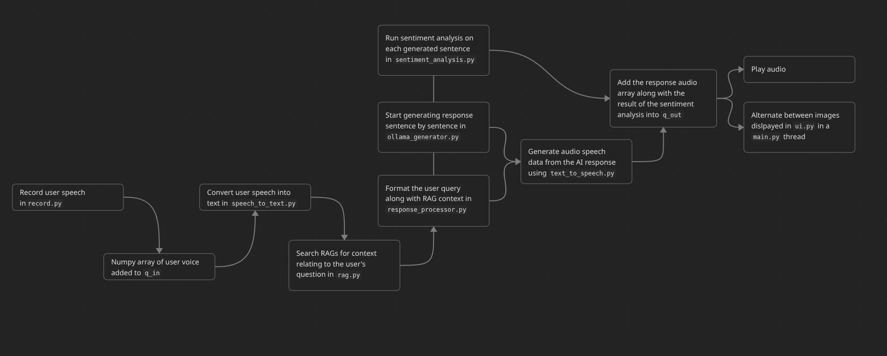

### This is a fully local pipeline of an AI assistant
This program automatically detects speech, converts it into text using `STT`, searches a local `RAGs` database for added context, passes that text onto a locally installed `ollama` model, segments the response into sentences and feeds them into a `TTS` model to emulate the AI talking back at the user, while simultaneously running a `sentiment analysis` on the response sentence to animate a PNGtuber image to reflect the emotion behind the response.



Any of the used models, artwork for any emotion, or the RAG database can be substituted by the user. This repository includes an example for demonstration purpose. You can add any of your desired PDF files inside the folder "RAG_SOURCE", or change any of the images within "ANIMATIONS" subfolders, or any of the models changing "settings.py" to configure your own AI assistant however you want it. My goal is to show you that you can do all of that for free on your own local machine. This is essentially the glue that combines and organizes several freely available tools.

The code assumes you are on a linux machine, using an Nvidia GPU with working CUDA. I do not have access to a GPU from another company for testing so I can't speak for the reliability.
If you are on windows, you likely have ollama installed under WSL, which is a potential layer of complication that I have not tested for.

### System dependencies:
portaudio

https://packages.debian.org/sid/portaudio19-dev
```
sudo apt install portaudio19-dev
```
ollama

https://ollama.com/download
```
curl -fsSL https://ollama.com/install.sh | sh
```

LLM of choice
```
ollama pull llama3.2:1b
```

# Models used:
- Speech-to-text: `openai/whisper-base.en"`

https://huggingface.co/openai/whisper-base.en

- RAGS: `sentence-transformers/all-MiniLM-L6-v2`

https://huggingface.co/sentence-transformers/all-MiniLM-L6-v2

- Large language model: `llama3.2:1b`

https://ollama.com/library/llama3.2

- Text-to-speech: `kokoro`

https://huggingface.co/hexgrad/Kokoro-82M

- Sentiment analysis: `boltuix/bert-emotion`

https://huggingface.co/boltuix/bert-emotion

### More models can be found at
https://huggingface.co/models

# Setting up RAGs:
The program recognizes PDF files that are placed within the folder `RAG_SOURCE`. Simply add the desired PDF files into that folder and run the included `rag.py` once.

# Changing included PNGtuber
You can paste any picture into the "ANIMATIONS/{emotion}" folder. The names of the folders match the output of the sentiment analysis model `boltuix/bert-emotion`, so it is important to not change the names of these folders. What I did was change the facial expressions of the PNGtuber by changing the features individually to reflect emotions.

# System prompts
System prompts are captured from the "system_prompts.txt" file if there is no "conversation_history.json" file. Otherwise, it will be passed directly from "conversation_history.json" along with any previous conversation and additional RAGs context (if present)

### Artist credit


オギャ美
https://picrew.me/en/search/creator?crid=4416848

Original Art:
https://picrew.me/en/image_maker/2361049

Find more PNGTubers (by Iiji):
https://docs.google.com/document/d/1xuLykMNFDOj_7cRN09Suqf0wecZ1VufzN9OEY9PDkzg/edit?pli=1&tab=t.0
